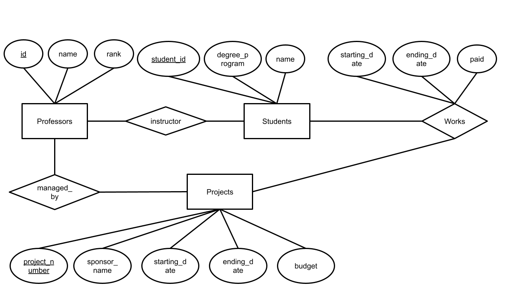

# Problem 1 

106033233 資工21 周聖諺

## ER Diagram



## Relational Model Schema

```
CREATE TABLE Professors(
    id serial NOT NULL,
    name VARCHAR(50),
    rank INT,
    PRIMARY KEY (id)
);
CREATE TABLE Projects(
    project_number serial NOT NULL,
    sponsor_name VARCHAR(50),
    starting_date timestamp, 
    ending_date timestamp, 
    budget INT,
    managed_by INT NOT NULL,
    PRIMARY KEY (project_number),
    FOREIGN KEY (managed_by)REFERENCES Professors ON DELETE CASCADE
);
create type Degree as enum('Bachelor', 'Master', 'PhD');
CREATE TABLE Students(
    student_id serial NOT NULL,
    name VARCHAR(50),
    degree_program Degree,
    instructor INT NOT NULL,
    PRIMARY KEY (student_id),
    FOREIGN KEY (instructor)REFERENCES Professors ON DELETE CASCADE
);
CREATE TABLE Works(
    project_number INT NOT NULL,
    student_id INT NOT NULL,
    starting_date timestamp,
    ending_date timestamp,
    paid INT,
    PRIMARY KEY (project_number, student_id),
    FOREIGN KEY (project_number)REFERENCES Projects ON DELETE CASCADE,
    FOREIGN KEY (student_id)REFERENCES Students ON DELETE CASCADE
);
```

# Problem 2

### Table Fourms

|<ins>fourm_name</ins>|popularity|
|---|---|
|Gossiping|100|
|Joke|23|

Field ```fourm_name``` is the primary key.

### Table Posts

|<ins>post_id</ins>|title|article|reply|fourm_name|
|---|---|---|---|---|
|131|Girlfriend|How can I get girlfriend ?|["Haha", "I don't know"]|Gossiping|
|252|Firends|I don't have a friend...|["Haha", "I can be", "QQ"]|Gossiping|
|46|Knock|Knock! Knock! ...|["Then?", "What's the point ?"]|Joke|
|151|Santa Claus|Hold! Hold! Hold!|["XDD"]|Joke|

Field ```post_id``` is the primary key.

Field ```fourm_name``` is the foreign key refering to the field ```fourm_name``` of table ```Fourms```.

```
CREATE TABLE Fourms(
    fourm_name VARCHAR(50),
    popularity INT,
    PRIMARY KEY (fourm_name)
);
CREATE TABLE Posts(
    post_id serial NOT NULL,
    title VARCHAR(50),
    article VARCHAR(50),
    reply TEXT[],
    fourm_name VARCHAR(50) NOT NULL,
    PRIMARY KEY (post_id),
    FOREIGN KEY (fourm_name)REFERENCES Fourms ON DELETE CASCADE
);
```